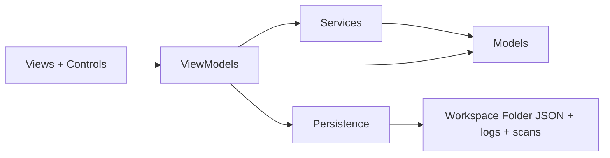
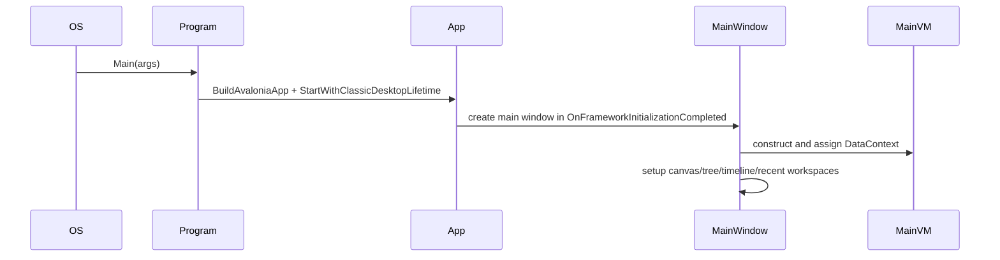
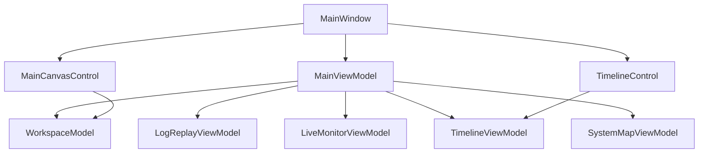
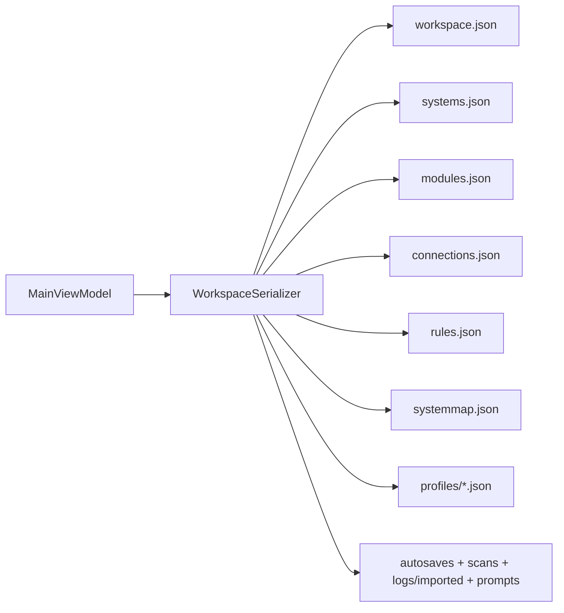
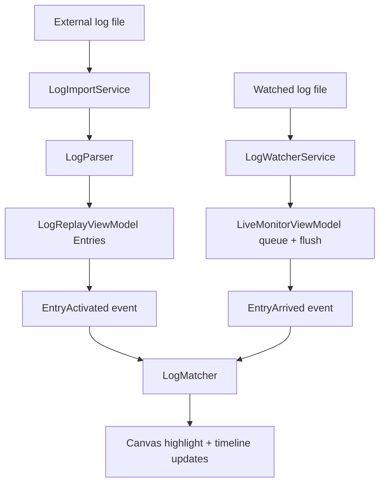
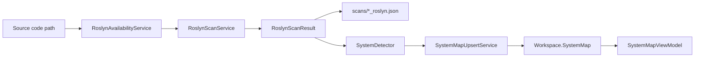

# Codomon Developer Overview

## What This App Is

Codomon is a desktop application for understanding and monitoring complex codebases.
It combines:

- A visual workspace of systems, modules, and connections
- Log import, replay, and live log monitoring
- Static code scanning with Roslyn
- A higher-level System Map model for architecture understanding

Think of it as a "code telescope": one place to map architecture, inspect runtime signals, and keep workspace knowledge persisted on disk.

## Tech Stack At A Glance

- Runtime: .NET 8
- UI framework: Avalonia (desktop, cross-platform)
- Main pattern: MVVM-style view models + services + persistence
- Graph canvas: NodifyAvalonia
- Static analysis: Microsoft.CodeAnalysis (Roslyn)

## High-Level Architecture

### Layer roles

- Views/Controls: render UI and forward user actions.
- ViewModels: hold state and orchestrate workflows.
- Services: reusable feature logic (scan, parsing, matching, detection, etc.).
- Persistence: load/save workspace data and snapshots.
- Models: data structures for systems, logs, profiles, system map, and scan results.

## Startup Path

This is the application boot sequence from process start to first window.

## Main Runtime Orchestration

The main window is the composition root for UI wiring, while the main view model is the composition root for workspace state.

## Workspace Data Model (Conceptual)

A workspace captures both diagram layout and analysis/runtime artifacts.

- Identity: workspace name and source project path
- Diagram graph: systems, modules, manual/derived connections
- Profiles: alternate layouts and view states
- Runtime config: mapping rules, watched log paths, last browsed folder
- LLM settings: endpoint/model for summary/hypothesis features
- System Map: interpreted architecture model with confidence/evidence

## Persistence Model

Workspace persistence is file-based JSON with explicit folders.

Notes:

- Workspace save captures active profile layout before writing files.
- Load supports backward-compatible optional files (for newer features).
- Autosave is timer-based while a workspace is open.

## Log Ingestion and Playback

There are two runtime sources: imported logs and live file tailing.

## Static Analysis and System Mapping

Roslyn scanning and System Map features provide structural understanding from source code.

Key idea:

- Suggestions are merged idempotently using identity keys and confidence precedence.
- Manual overrides are reapplied on load so human edits remain authoritative.

## Where To Start As A New Developer

Recommended reading order:

1. App startup and shell creation
2. Main window UI wiring and event handling
3. Main view model workspace lifecycle
4. Persistence format and save/load behavior
5. Log runtime pipeline (import/replay/live)
6. Roslyn scan pipeline and System Map merge logic

Suggested first files to inspect:

- Codomon.Desktop/Program.cs
- Codomon.Desktop/App.axaml.cs
- Codomon.Desktop/Views/MainWindow.axaml.cs
- Codomon.Desktop/ViewModels/MainViewModel.cs
- Codomon.Desktop/Persistence/WorkspaceSerializer.cs
- Codomon.Desktop/ViewModels/LogReplayViewModel.cs
- Codomon.Desktop/ViewModels/LiveMonitorViewModel.cs
- Codomon.Desktop/Services/RoslynScanService.cs
- Codomon.Desktop/Services/SystemDetector.cs
- Codomon.Desktop/Services/SystemMapUpsertService.cs

## Mental Model For Working Safely

When changing behavior, ask which layer owns the responsibility:

- UI behavior issue: likely MainWindow or a specific view/control.
- State orchestration issue: usually a view model.
- Domain logic issue: usually a service.
- Data integrity or compatibility issue: persistence and model DTO mapping.

If you keep responsibilities in those boundaries, the codebase stays easier to reason about as it grows.
